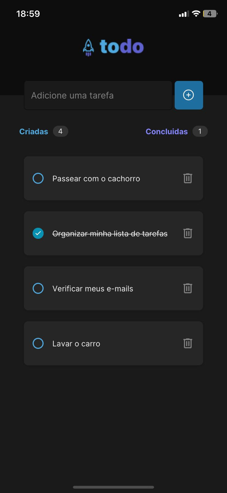
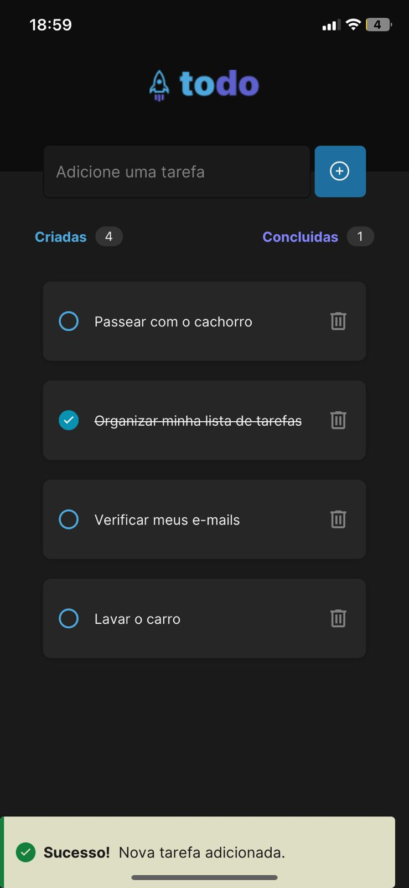

<p align="center">
  
</p>

<p align="center">
    <strong>Aplicativo Mobile de todo list.</strong>
</p>

<p align="center">
 <a href="#-sobre-o-projeto">Sobre</a> •
 <a href="#-tecnologias-utilizadas">Tecnologias</a> • 
 <a href="#-instalação-e-uso">Instalação</a>
</p>

<h4 align="center"> 
	🚧  Projeto em construção 🚧
</h4>

## 💻 Sobre o projeto

checkmate-app foi criado como base na resolução do desafio do curso Ignite (trilha atualizada) da Rocketseat. Aplicação utilizada para praticar desenvolvimento de apps
CRUD(Create, Read, Update, Delete), e também praticar uma biblioteca diferente de componentes(NativeBase)


## Funcionalidades

- [x] Criar Tarefas
  - [x] Inserção com enter
  - [x] Tratamento de Exeções de campo vazio

- [x] Ecluir Tarefas
  - [x] Apagar tarefa
  - [x] Tratamento de error ao excluir tarefas

- [x] Alterar estado da tarefa
  - [x] Marcar como concluído
  - [x] Feedback de task concluída


### Mobile

<p align="left">


</p>

## 🔨 Tecnologias utilizadas

As seguintes ferramentas foram usadas na construção do projeto:

- **[ReactNative](https://reactnative.dev/)**
- **[TypeScript](https://www.typescriptlang.org/)**
- **[Expo](https://expo.dev/)**
- **[NativeBase](https://nativebase.io/)**

## 🚀 Instalação e uso

```bash
# Clone o repositório
git clone https://github.com/Fabriciomdec/CheckMate.git
# Instale as dependências
yarn install
# Execute a aplicação
expo start
```

## :busts_in_silhouette: Team

Aplicação Web 
- Em Desenvolvimento por: https://github.com/rodrigopacheco100
- Link: https://github.com/Devs-Calvos/checkmate-web

BackEnd
- Em Desenvolvimento por: https://github.com/rodrigofmeneses
- Link: https://github.com/rodrigofmeneses/check-mate-contrib
